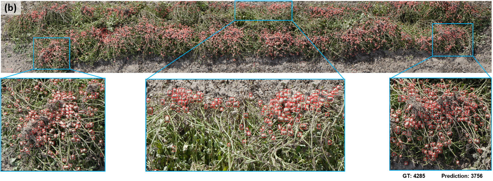

# Plot-scale-peanut-counting
The repository is for the paper: Robotic Plot-Scale Peanut Yield Estimation using Transformer-based Image Stitching and Detection

## Pipeline
<p align="center">
  
</p>
<p align="center"><i>Fig. 1: Diagram of the proposed blueberry fruit phenotyping workflow involving four stages: data collection, training dataset generation, model training, and phenotyping traits extraction.</i></p>

## LoFTR-based image stitching
<p align="center">
  
</p>
<p align="center"><i>Fig. 2: The procedure of the image stitching algorithm using LoFTR. </i></p>

## Customized RT-DETR Architecture
<p align="center">
  
</p>
<p align="center"><i>Fig. 3: Illustration of improved RT-DETR detector. (a) overview of customized RT-DETR detector; (b) Backbone of ResNet18-FasterBlock; (c) Up sampling based on DySample; (d) Adown module for down sampling. </i></p>

## Result example
<p align="center">
  
</p>
<p align="center"><i>Fig. 4: Illustration of plot-scale pod counting. </i></p>


## Prerequisites

[YOLOv8](https://github.com/ultralytics/ultralytics)
```
pip install ultralytics
```

## Environment Setting
Clone the repository to local machine:
```
git clone https://github.com/UGA-BSAIL/Plot-scale-peanut-counting.git
```
Create a virtual env and Install the required packages :
```
conda create -n rt-detr-peanut python=3.8
conda activate rt-detr-peanut
pip install ultralytics
pip install scikit-learn
pip install kornia
```
We modified the original YOLOv8 repository for more module support (yolov8-BerryNet\ultralytics\nn\extra_modules). For letting ultralytics point to the modified repository, 
```
pip uninstall ultralytics
```


## Dataset Download
This paper released a dataset for model training and validation of peanut detection, which is available on kaggle:
  * [MARS-Peanut-Detection](https://www.kaggle.com/datasets/zhengkunli3969/mars-peanut-detection)


## LoFTR-based image stitching
We provide a script to stitch the sequential images based on the LoFTR matching method.
```
python script/image_stitching/loftr-stitching-gpu.py
```
  &nbsp;Parameters:  
    &nbsp; &nbsp;- folder_path  = '/path/to/image_folder'
     &nbsp; &nbsp; &nbsp; - folder structure: folder_path/sequences_folder/image_1, image2, ...

## Mentashape-based image stitching
We provide two scripts to stitch the sequential images of single/double views. 

 &nbsp; * script/image_stitching/metashape_single_view.py
 
 &nbsp; * image_stitching/metashape-stitching_left_right.py
 
Open the Metashape and load the script to process multiple plots.

  &nbsp;Parameters:  
    &nbsp; &nbsp; * - frame_path  = '/path/to/image_folder'
     &nbsp; &nbsp; * - save_path =  ''/path/to/save_orthomosaic_folder'
     
     

## Model Training
The model architecture of customized RT-RTDETR was defined in customized_rtdetr/ultralytics/cfg/models/rt-detr/rtdetr-resnet18-FasterBlock-ADown-Dysample.yaml.

For training the model, run the script: 
    &nbsp; &nbsp; -  train-detr-r18-fasterBlock-ADown-Dysample-peanut-1280.py (or select the 640) under the path of customized_rtdetr folder:
```
cd customized_rtdetr
python train-detr-r18-fasterBlock-ADown-Dysample-peanut-1280.py
```
Before running the script, please modify the path of the dataset and the model configuration file in the script. 
You can try more yaml files for different model architecture.


## Pre-trained models
The pre-trained models are available at [weight](weight).  
    &nbsp; &nbsp;- customized_rtdetr:  
    &nbsp; &nbsp;- yolov8:  


## Inference on plot-scale image
For model inference, run the script of BerryNet_phenotyping_extraction_split.py under the script folder:
```
python script/plot-scale_detection/plot-scale_detection.py
```
  &nbsp;Parameters:  
    &nbsp; &nbsp;- model_path = " "    # path to the BerryNet model  
    &nbsp; &nbsp;- image_folder = " "  # path to the image folder  
    &nbsp; &nbsp;- save_path = " "     # path to the save folder  


## References
If you find this work or code useful, please cite:

```
****************************
```
